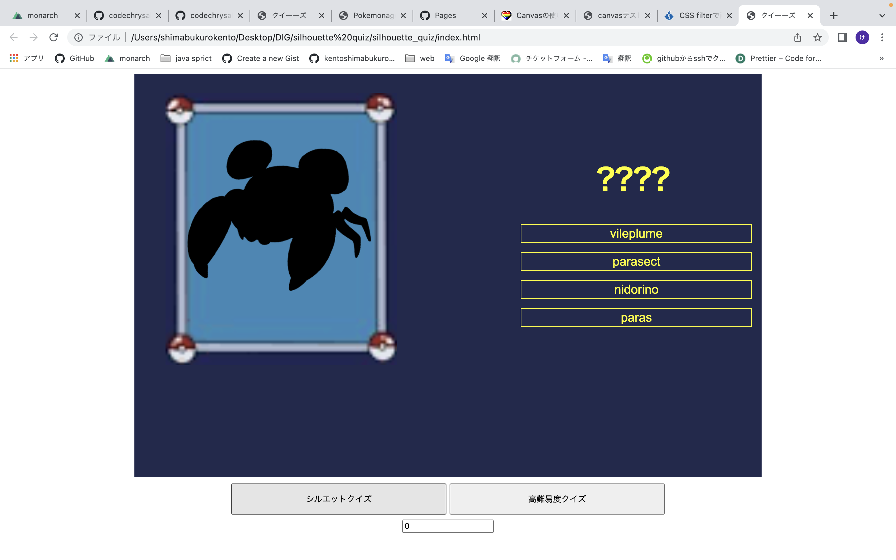

# silhouette_quiz

## 概要

1997 年から放送が開始されたアニメポケットモンスターの前編後編の隙間に登場したあのクイズを作成しました！

ウィンドウを最大化して使用してください


## 使い方

- アプリを開くとお馴染みのシルエットクイズが登場します
- ４つの候補の中から正解と思われる名前をクリックしてクイズに回答してください
- クイズは２種類の難易度を用意しています。「シルエットクイズ」もしくは「高難易度クイズ」のボタンをクリックすると新しくクイズがスタートします

# 技術面

## 開発環境

本プロジェクトは VSCode, Google Chrome で開発を進めた
プロジェクトディレクトリで node プロジェクトを作成する。

```
node init -y
```

## SCSS の導入

`node-scss`を使用した。

```
npm install -D node-scss
```
